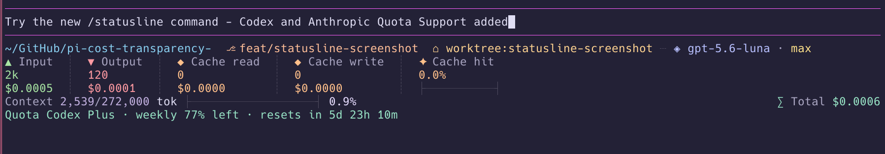

# @nilskluewer/pi-cost-transparency-statusline

A cost transparency status line for the [Pi coding agent](https://pi.dev/).

## Setup

```text
/statusline
```

After installing the package, run `/statusline` in Pi to open the selector and choose the status-line items to display.



It replaces Pi's footer with a compact pastel telemetry dashboard that makes token usage and spend fully transparent:

- current working directory, Git branch, and Git worktree name or no-worktree status
- active model and thinking level
- accumulated input/output/cache-read/cache-write tokens
- cache hit rate with a colored progress rail
- context window usage with a colored progress rail
- full cost breakdown: input, output, cache read, cache write, and total
- configurable task progress and extension statuses
- Codex or Anthropic subscription quota when provider data is available

## Install

```bash
pi install npm:@nilskluewer/pi-cost-transparency-statusline
```

For local development, install the checkout directly. Pi keeps the path live, so edits are available after `/reload`:

```bash
pi install /absolute/path/to/pi-cost-transparency-statusline
```

## Configure

The `/statusline` selector follows Codex's status-line configuration pattern. Toggle items with Space or Enter, search with typing, and close with Escape. Preferences are stored in `${PI_CODING_AGENT_DIR:-~/.pi/agent}/pi-cost-transparency-statusline.json`.

The same settings are available without the selector:

```text
/statusline list
/statusline add run-state
/statusline remove cache-write
/statusline reset
```

Available items include model/reasoning, Git branch/worktree, all token/cache counters, context, estimated session cost, extension task progress, and subscription quota.

In a Git worktree, the first line includes both identities:

```text
/tmp/project/feature-worktree  ⎇ feature  ⌂ worktree:feature-worktree
```

## Subscription quota

The session cost rows work with Codex subscription authentication because Pi records usage on every assistant response. These are estimated API-equivalent costs from Pi's model catalogue, not an invoice or subscription charge.

When `openai-codex` uses ChatGPT OAuth, the optional quota row queries the local Codex app server (`account/rateLimits/read`). It follows Codex's wording and shows the rolling window, remaining percentage, plan, and reset countdown without making a model request:

```text
Quota Codex Plus · weekly 78% left · resets in 6d 19h 3m
```

API-key authentication does not expose ChatGPT subscription quota.

For Anthropic/Claude OAuth, Pi uses subscription rate-limit headers when the provider exposes them. API-key usage is not presented as a subscription quota.

## Patch notes

See [PATCH_NOTES.md](./PATCH_NOTES.md) for the current feature and compatibility notes.

## Notes

This package was previously published as `@nilskluewer/pi-statusline`.
Use this package going forward.


## License

MIT
